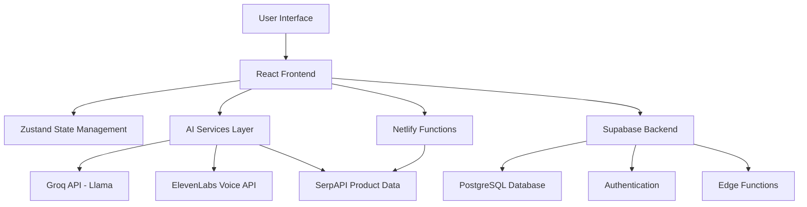

# Design Document

## Overview

goCartAI is architected as a modern, scalable AI-powered shopping assistant that combines conversational AI, real-time product data, and seamless e-commerce integration. The system uses a React-based frontend with TypeScript, Supabase for backend services, and multiple AI APIs to deliver a comprehensive shopping experience.

## Architecture

### High-Level Architecture



### Frontend Architecture

- **React 18** with functional components and hooks
- **TypeScript** for type safety and developer experience
- **Vite** for fast development and optimized builds
- **Tailwind CSS** for responsive, utility-first styling
- **React Router** for client-side routing
- **Zustand** for lightweight state management

### Backend Architecture

- **Supabase** as Backend-as-a-Service
- **PostgreSQL** for relational data storage
- **Row Level Security (RLS)** for data access control
- **Netlify Functions** for serverless API endpoints
- **Edge Functions** for real-time processing

## Components and Interfaces

### Core Components

#### 1. goCartAssistant Component
```typescript
interface goCartAssistantProps {
  isOpen: boolean
  onClose: () => void
}

interface Message {
  id: string
  type: 'user' | 'assistant'
  content: string
  timestamp: Date
  products?: Product[]
}
```

**Responsibilities:**
- Manage conversation flow
- Handle voice input/output
- Display product recommendations
- Integrate with AI services

#### 2. ProductCard Component
```typescript
interface ProductCardProps {
  product: Product
  onQuickAdd?: () => void
}

interface Product {
  id: string
  name: string
  price: number
  image_url: string
  rating: number
  review_count: number
  brand: string
  stock_quantity: number
  description?: string
}
```

**Responsibilities:**
- Display product information
- Handle add-to-cart actions
- Show pricing and availability
- Provide quick purchase options

#### 3. FloatinggoCartButton Component
```typescript
interface FloatinggoCartButtonProps {
  position?: 'bottom-right' | 'bottom-left'
  showTooltips?: boolean
}
```

**Responsibilities:**
- Provide entry point to AI assistant
- Display contextual tooltips
- Maintain visual prominence
- Handle accessibility requirements

#### 4. CheckoutPage Component
```typescript
interface CheckoutPageProps {
  cartItems: CartItem[]
  user: User | null
}

interface CheckoutFormData {
  shipping: ShippingInfo
  payment: PaymentInfo
}
```

**Responsibilities:**
- Collect shipping information
- Process payment details
- Handle order submission
- Provide order confirmation

### State Management

#### Zustand Store Structure
```typescript
interface StoreState {
  // User state
  user: User | null
  setUser: (user: User | null) => void
  
  // Cart state
  cartItems: CartItem[]
  addToCart: (product: Product, quantity: number) => void
  removeFromCart: (productId: string) => void
  updateQuantity: (productId: string, quantity: number) => void
  clearCart: () => void
  
  // UI state
  goCartOpen: boolean
  setgoCartOpen: (open: boolean) => void
  
  // Product state
  products: Product[]
  loadProducts: () => Promise<void>
  searchProducts: (query: string) => Promise<Product[]>
  
  // Conversation state
  messages: Message[]
  addMessage: (message: Message) => void
  clearMessages: () => void
}
```

### AI Services Integration

#### 1. Groq API Integration
```typescript
interface GroqService {
  generateResponse(
    messages: Message[],
    context: ShoppingContext
  ): Promise<AIResponse>
  
  analyzeIntent(userInput: string): Promise<Intent>
  
  generateProductRecommendations(
    query: string,
    budget?: number,
    mood?: string
  ): Promise<RecommendationResponse>
}
```

#### 2. ElevenLabs Voice Service
```typescript
interface VoiceService {
  synthesizeSpeech(text: string): Promise<AudioBuffer>
  
  startSpeechRecognition(): Promise<string>
  
  stopSpeechRecognition(): void
  
  playAudio(audioBuffer: AudioBuffer): Promise<void>
}
```

#### 3. SerpAPI Product Service
```typescript
interface ProductService {
  searchProducts(query: string): Promise<Product[]>
  
  getProductDetails(productId: string): Promise<Product>
  
  getProductsByCategory(category: string): Promise<Product[]>
}
```

## Data Models

### Database Schema

#### Users Table (Supabase Auth)
```sql
-- Handled by Supabase Auth
-- Additional user metadata stored in user_metadata
```

#### Products Table
```sql
CREATE TABLE products (
  id UUID PRIMARY KEY DEFAULT gen_random_uuid(),
  serpapi_id TEXT UNIQUE NOT NULL,
  name TEXT NOT NULL,
  description TEXT,
  price DECIMAL(10,2) NOT NULL,
  image_url TEXT,
  category_id UUID REFERENCES categories(id),
  stock_quantity INTEGER DEFAULT 0,
  rating DECIMAL(3,2) DEFAULT 0,
  review_count INTEGER DEFAULT 0,
  brand TEXT,
  created_at TIMESTAMP WITH TIME ZONE DEFAULT NOW(),
  updated_at TIMESTAMP WITH TIME ZONE DEFAULT NOW()
);
```

#### Cart Items Table
```sql
CREATE TABLE cart_items (
  id UUID PRIMARY KEY DEFAULT gen_random_uuid(),
  user_id UUID REFERENCES auth.users(id) ON DELETE CASCADE,
  product_id UUID REFERENCES products(id) ON DELETE CASCADE,
  quantity INTEGER NOT NULL DEFAULT 1,
  created_at TIMESTAMP WITH TIME ZONE DEFAULT NOW(),
  updated_at TIMESTAMP WITH TIME ZONE DEFAULT NOW(),
  UNIQUE(user_id, product_id)
);
```

#### Orders Table
```sql
CREATE TABLE orders (
  id UUID PRIMARY KEY DEFAULT gen_random_uuid(),
  user_id UUID REFERENCES auth.users(id) ON DELETE CASCADE,
  total_amount DECIMAL(10,2) NOT NULL,
  status TEXT NOT NULL DEFAULT 'pending',
  created_at TIMESTAMP WITH TIME ZONE DEFAULT NOW(),
  updated_at TIMESTAMP WITH TIME ZONE DEFAULT NOW()
);
```

#### Order Items Table
```sql
CREATE TABLE order_items (
  id UUID PRIMARY KEY DEFAULT gen_random_uuid(),
  order_id UUID REFERENCES orders(id) ON DELETE CASCADE,
  product_id UUID REFERENCES products(id),
  quantity INTEGER NOT NULL,
  price DECIMAL(10,2) NOT NULL,
  created_at TIMESTAMP WITH TIME ZONE DEFAULT NOW()
);
```

### TypeScript Interfaces

#### Core Data Types
```typescript
interface User {
  id: string
  email: string
  full_name?: string
}

interface Product {
  id: string
  serpapi_id?: string
  name: string
  description?: string
  price: number
  image_url: string
  category_id?: string
  stock_quantity: number
  rating: number
  review_count: number
  brand: string
}

interface CartItem {
  id: string
  product: Product
  quantity: number
}

interface Order {
  id: string
  user_id: string
  total_amount: number
  status: 'pending' | 'paid' | 'shipped' | 'delivered' | 'cancelled'
  created_at: string
  items: OrderItem[]
}

interface OrderItem {
  id: string
  order_id: string
  product: Product
  quantity: number
  price: number
}
```

## Error Handling

### Error Types and Handling Strategy

#### 1. API Errors
- **Network failures**: Retry with exponential backoff
- **Rate limiting**: Queue requests and implement throttling
- **Authentication errors**: Redirect to login flow
- **Service unavailable**: Graceful degradation with fallback options

#### 2. User Input Errors
- **Invalid queries**: Provide suggestions and corrections
- **Empty results**: Offer alternative search terms
- **Voice recognition errors**: Fallback to text input
- **Form validation**: Real-time validation with clear error messages

#### 3. System Errors
- **Database connection issues**: Cache data locally when possible
- **Payment processing errors**: Clear error messages and retry options
- **Cart synchronization issues**: Conflict resolution strategies
- **Session management**: Automatic session recovery

### Error Recovery Mechanisms

```typescript
interface ErrorHandler {
  handleAPIError(error: APIError): Promise<void>
  handleUserError(error: UserError): void
  handleSystemError(error: SystemError): Promise<void>
  logError(error: Error, context: ErrorContext): void
}
```

## Testing Strategy

### Unit Testing
- **Component testing**: React Testing Library for component behavior
- **Utility function testing**: Jest for business logic
- **API integration testing**: Mock external services
- **State management testing**: Zustand store operations

### Integration Testing
- **End-to-end flows**: Cypress for complete user journeys
- **API integration**: Test real API interactions in staging
- **Cross-browser testing**: Ensure compatibility across browsers
- **Mobile responsiveness**: Test on various device sizes

### Performance Testing
- **Load testing**: Simulate high user concurrency
- **API response times**: Monitor and optimize slow endpoints
- **Bundle size optimization**: Analyze and reduce JavaScript payload
- **Memory leak detection**: Profile component lifecycle

### Accessibility Testing
- **Screen reader compatibility**: Test with assistive technologies
- **Keyboard navigation**: Ensure full keyboard accessibility
- **Color contrast**: Verify WCAG compliance
- **Focus management**: Proper focus handling in modals and forms

## Security Considerations

### Data Protection
- **API key security**: Environment variables and server-side proxy
- **User data encryption**: Encrypt sensitive information at rest
- **HTTPS enforcement**: All communications over secure connections
- **Input sanitization**: Prevent XSS and injection attacks

### Authentication and Authorization
- **Supabase Auth**: Secure authentication with JWT tokens
- **Row Level Security**: Database-level access control
- **Session management**: Secure session handling and timeout
- **Password policies**: Strong password requirements

### Privacy Compliance
- **Data minimization**: Collect only necessary user data
- **Consent management**: Clear privacy policy and user consent
- **Data retention**: Implement data deletion policies
- **Third-party integrations**: Ensure partner compliance

## Performance Optimization

### Frontend Optimization
- **Code splitting**: Lazy load components and routes
- **Image optimization**: WebP format and responsive images
- **Caching strategies**: Browser caching and service workers
- **Bundle optimization**: Tree shaking and minification

### Backend Optimization
- **Database indexing**: Optimize query performance
- **Connection pooling**: Efficient database connections
- **Caching layers**: Redis for frequently accessed data
- **CDN integration**: Global content delivery

### AI Service Optimization
- **Response caching**: Cache common AI responses
- **Request batching**: Combine multiple API calls
- **Streaming responses**: Real-time response delivery
- **Fallback mechanisms**: Graceful degradation when services are slow